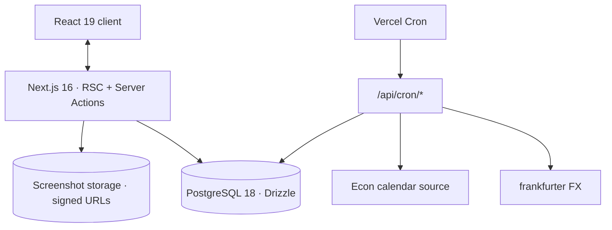
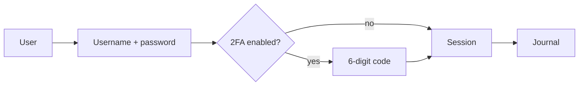
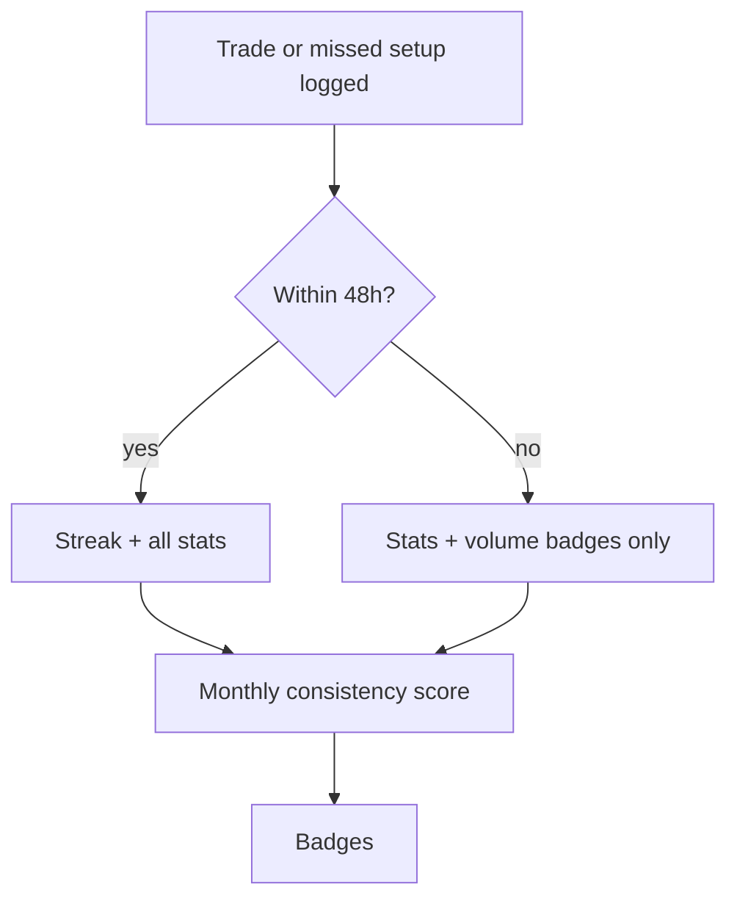

## Trading-Journal — Project Specifications

📓 Trade Journal for prop-firm futures traders

---

## 📌 Problem (Core Idea)

Prop-firm futures traders lose money for reasons that have nothing to do with their
setup being wrong:

- Trades logged in a spreadsheet that never gets reviewed
- Screenshots buried in a phone camera roll
- Confluences remembered, not recorded, so nobody knows which ones actually pay
- Missed setups forgotten entirely, so the same hesitation repeats
- Prop firm rules scattered across FAQs, T&Cs and Discord threads that contradict each other
- Journaling abandoned after two weeks because nothing rewards the habit

The result is **no feedback loop**: a trader with 200 trades and no data about them
is a trader on trade one.

➡️ **This app turns journaling into a habit with a scoreboard, and the scoreboard
never rewards profit.**

---

## 🧑‍💻 Users

| Persona | Needs |
| --- | --- |
| Funded / evaluation trader | Log fast, see whether the edge is real, stay inside firm rules |
| Consistency builder | A streak and a score that reward showing up, not winning |
| Multi-account trader | Separate demo, evaluation, backtest and live accounts, one journal |
| Habit builder | Badges and a consistency score that reward showing up |

---

## ✨ Core Features

### A) Trades & Missed Setups

Every entry is either **taken** or **missed**. A missed setup counts for streak and
badges and is excluded from every P&L, win rate and R figure.

Fields per trade: date, instrument, contracts, accounts it belongs to, entry/exit
time, session, direction, setup type, entry model, entry / exit / stop price, MFE and
MAE in R, points captured, P&L override, result, grade, felt, by-the-book flag, notes,
screenshots, links.

**Post-exit MFE** is a separate manual field, shown only when a stop price is set. It
cannot be derived, because deriving it would need price data after the exit and market
data is out of scope.

P&L and R multiple are derived live from the prices and the instrument's point value,
and stay editable.

### A2) Accounts

The user creates and names their own accounts — for example Demo, Propfirm-Eval,
Propfirm-Eval-2, Backtesting, Live. Names are free text, there is no fixed list, and
accounts can be renamed, reordered and archived.

Every trade is assigned to **one or more** accounts. Assigning one trade to several
accounts is the copy-trading case: the same execution ran on several accounts at once.
A trade must belong to at least one account.

Each account carries one switch, **Practice account** (`is_practice`), off by default.
On means the account is for practice — Backtesting, Demo — and its entries no longer
feed streak, consistency score or badges. It is a plain toggle in
account settings, set per account and changeable at any time. The account name stays
free text; nothing is ever inferred from what an account is called, because a user may
well name a live account "Backtest results".

Consequences that follow from this and are not optional:

- **Account selector** in the app shell, remembered per user. "All accounts" means all
  real accounts; a practice account is only ever visible when selected on its own.
  Plus an account filter in the journal list and "By account" as an eleventh analytics
  dimension.
- **Import** asks which account(s) a file's rows belong to before the preview is
  confirmed.
- **Settings** holds account management and the default account selection for new
  trades, replacing the old default account count.
- **Archiving is the only way out while trades exist.** Archiving keeps every trade and
  all history, and the account disappears from pickers. Hard deletion is offered only
  for an account with zero assigned trades. Since a trade must always have at least one
  account, there is no path that leaves an orphan and no destructive surprise.

### B) Confluences & Mistakes

Tag taxonomy in six groups — Session, Volume Profile, ICT, Derived, Continuation,
Other — plus a Mistakes list (chased entry, moved stop, cut winner early, oversized,
no confluence, traded news, revenge trade, broke daily limit, traded outside session,
ignored higher timeframe). Both are join tables so they aggregate properly.

### C) Screenshots & Links

**Uploads:** up to three screenshots per trade, resized to 1600px and compressed in the
browser before upload. Private to the account, served through signed URLs only.

**Links:** any number of external URLs per trade with an optional label — a TradingView
snapshot, a chart layout, a recorded review. Stored as a URL, never fetched or embedded
server-side, opened in a new tab. HTTPS only.

Both are optional, and both count toward journaling completeness in the consistency
score. A trade may have neither, either or both.

### D) CSV Import

**Export** is always the whole journal, never the current view: one row per trade,
assigned accounts as a semicolon-separated column, plus an `is_practice` column so the
real/practice split survives a re-import. An export that depends on a UI filter is not
a backup.

**Import** takes a broker, prop platform or TradingView export. Shape is auto-detected (round-trip rows,
individual fills, TradingView trade list). File or paste, up to 2000 rows, nothing
saved until the preview is confirmed. Imports are grouped into batches and can be
undone; a batch removal deletes only untouched imported trades, and anything since
enriched by hand is kept. Sessions can be derived from entry time, never overwriting a
session the user picked.

### E) Dashboard

Net P&L, win rate, trades logged, profit factor, expectancy, max drawdown, avg winner,
avg loser, avg R, current streak, best day, worst day, today. Plus logging streak,
consistency score, badge count, a P&L calendar heatmap, recent trades,
and the pre-market plan with an optional end-of-day review.

### F) Analytics

Aggregation across eleven dimensions: account, setup type, entry model, session,
instrument, weekday, hour of day, confluence, emotional state, execution grade,
mistake. Each with
trades, win rate, net P&L and avg R. Plus hold time, risk calibration from MFE/MAE,
exit efficiency from post-exit MFE, and a separate missed-setups section that touches
no P&L number.

### G) Progress

Streak, consistency score, twelve badges in four categories (Getting started, Volume,
Streaks, Craft). All of it is personal — nothing is ranked against other users and
nothing is published.

### H) Prop Firm Rules

15 firms with 2026 rule sets, 18 rule fields each, search, filter chips, expandable
detail, compare, firm website link and a "last verified" date.

**Source of record: `context/PropFirmsData.md`.** Curated by hand, no API. The app
never invents a rule; if a field is unknown it says so, and conflicts between a firm's
own pages are carried through as text rather than resolved.

Loaded by an **idempotent seeder** (`pnpm db:seed:propfirms`) that parses the file and
upserts by firm plus program, re-runnable any time, taking `last_verified_at` from the
file. Not a migration, because rules change when firms change them and migrations
should stay immutable. Not read at build time, because the page needs search and
filtering, and that is database work. Two clean-up items before
seeding: four of the fifteen blocks have lost their firm name, and the headings use
`##Name` without a space so they do not parse as markdown.

### I) Econ Calendar

This week / next week / both, high-impact filter, currency, forecast and previous value.

**Times render in the signed-in user's own timezone.** It is stored on `users`,
prefilled from the browser when the account is created, and changeable in settings, so
the calendar follows the person and not the device they happen to be on. This is the
only place a timezone is applied: trade entry and exit times are the user's chart clock
and stay unconverted.

**Source: the weekly Forex Factory JSON feed**, whose two endpoints map exactly onto
the "this week" and "next week" tabs. It is free and field-for-field what the UI needs,
but it is unofficial and carries no guarantee. Two consequences that are part of the
design, not caveats:

- The cron job writes into `econ_events`. **The app never calls the feed at request
  time**, so a feed outage costs freshness, never a page.
- The fetch and parse live behind an adapter in `src/lib/econ/`. If the feed changes
  shape or disappears, one file is replaced and nothing else moves.

### J) Settings

Profile, immutable username, Discord handle, account management (create, rename,
reorder, archive, practice toggle, set default for new trades), password change,
TOTP two-factor, timezone, display currency, CSV export, account deletion. No theme
toggle — the app is dark only.

---

## 📊 The Rules (Product Core)

> These are the product, not implementation details. They live in tested, DB-free
> modules under `src/domain/`.

**Streak.** A logged day is a trading day with at least one entry, taken or missed.
Counting requires logging within 48h of the trade date; later backfills count for
every other stat and for trade-count badges, but never manufacture a streak. Saturdays
are skipped. Sunday belongs to the new week because Globex opens Sunday evening, so a
Sunday-dated trade lands on Monday. One grace day per calendar month; a second skipped
weekday in the same month breaks the streak. Today never counts against the user until
it is over.

**Consistency score.** Monthly, out of 100 — showing up 40, journaling completeness 20,
plan adherence 25, review habit 15. Entries are averaged **per day first**, so twenty
trades in one day count exactly as much as one. P&L, win rate and R affect nothing.

**Accounts.** Figures default to all accounts combined and are switchable to a single
account.

- **Practice accounts are excluded from every combined figure**, not only from Net P&L.
  "All accounts" means all real accounts. Money, counts, calendar, equity curve, streak,
  score and badges all ignore them. A practice account's numbers are
  visible only when that account is selected on its own, and then they are complete.
  A mixed "real plus practice" view is deliberately not offered — one number that
  blends real and simulated results is worse than no number.
- **Money multiplies per account.** A trade assigned to several accounts is one
  copy-trading execution, so Net P&L, best and worst day, max drawdown and the equity
  curve count it once *per assigned account*. In the combined view the multiplier counts
  only the real accounts it is assigned to, so adding a practice account to an existing
  trade never moves a single figure. Filtered to one account, the per-account value is
  used with no multiplication.
- **Counts do not multiply.** Trades logged, win rate, avg R, hold time and MFE/MAE
  treat it as one trade, because it was one decision.
- **Nothing disappears silently.** A trade logged only to practice accounts still exists
  in the journal, keeps its notes, screenshots and links, and is fully editable. In the
  combined journal view it is hidden with a visible count and a one-click way to show
  it, so a saved entry is never simply absent.

**Currency.** Trades are stored in USD. One daily ECB rate per currency is applied to
every figure for display only, including historical ones. Prop firm limits stay in USD.

---

## 🗄️ Data Model (Rough Draft)

> Starting point, **will evolve**. The Drizzle schema lives in `src/db/schema/`.

```sql
users                (id, username UNIQUE, display_name, discord_username,
                      timezone, currency_display,
                      selected_account_id NULL,   -- remembered account selector,
                                                   -- NULL = "All accounts"
                      password_hash, totp_secret, created_at)

accounts             (id, user_id, name, sort_order,
                      is_default_for_new_trades BOOLEAN,
                      is_practice BOOLEAN DEFAULT false,
                      archived_at NULL, created_at)
                      -- name is user-supplied free text, no fixed types
                      -- is_practice on = practice account: excluded from every
                      --   combined figure, visible only when selected alone

trade_accounts       (trade_id, account_id)
                      -- one trade can belong to several accounts (copy trading)
                      -- at least one row per trade, enforced in the domain layer

instruments          (id, symbol, name, point_value NUMERIC(12,4), tick_size)

trades               (id, user_id, trade_date DATE, instrument_id,
                      taken BOOLEAN,                 -- false = missed setup
                      contracts INT,
                      entry_time TIME, exit_time TIME,   -- chart clock, never converted
                      session, direction, setup_type, entry_model,
                      entry_price NUMERIC(12,4), exit_price NUMERIC(12,4),
                      stop_price NUMERIC(12,4),
                      mfe_r NUMERIC(8,2), mae_r NUMERIC(8,2), post_exit_mfe_r NUMERIC(8,2),
                      points NUMERIC(12,4), pnl_override NUMERIC(14,2),
                      result, grade, felt, by_the_book BOOLEAN, notes TEXT,
                      import_batch_id NULL, created_at, updated_at)

confluence_tags      (id, group, label)
trade_confluences    (trade_id, confluence_tag_id)
mistake_tags         (id, label)
trade_mistakes       (trade_id, mistake_tag_id)
trade_screenshots    (id, trade_id, storage_key, sort_order)   -- max 3, private
trade_links          (id, trade_id, url, label NULL, sort_order) -- https only

daily_notes          (id, user_id, note_date DATE, premarket_plan, eod_review)

import_batches       (id, user_id, filename, row_count, created_at)

badge_defs           (id, key, category, title, description)
user_badges          (user_id, badge_def_id, earned_at)
monthly_scores       (user_id, month, score, showing_up, completeness,
                      plan_adherence, review_habit)

prop_firms           (id, name, website, last_verified_at)
prop_firm_programs   (id, firm_id, name, account_size, profit_target,
                      max_drawdown, daily_loss_limit, min_trading_days,
                      consistency_rule, consistency_when_funded, news_trading,
                      overnight, copy_trading, first_payout, payout_cycle,
                      max_payout_cycle, profit_split, live_program, scaling,
                      end_of_day_rule, notes)

econ_events          (id, occurs_at TIMESTAMPTZ, currency, title, impact,
                      forecast, previous)
fx_rates             (currency, rate_date DATE, rate_vs_usd)
```

Two decisions worth stating once: a missed setup is `trades.taken = false`, not a
second table; confluences use a join table, not a JSON column, because "By confluence"
in Analytics is a real `GROUP BY`.

---

## 🧱 Tech Stack

Decided. Pinned versions and the reasoning behind each line live in
`context/coding-standards.md`. Do not upgrade a line except in its own commit.

| Category | Choice |
| --- | --- |
| Framework | **Next.js 16.3** (App Router) |
| Language | TypeScript 7.0 |
| UI | React 19.2 |
| Database | PostgreSQL 18 |
| ORM | Drizzle 0.45 + drizzle-kit 0.31 |
| Auth | Better Auth 1.7 (username, password, TOTP) |
| CSS/UI | Tailwind CSS v4 + shadcn/ui (Radix) |
| Charts | Recharts 3 |
| Motion | motion 13.2 (ex framer-motion) |
| Forms | React Hook Form + Zod, schema shared with the server |
| File storage | Local disk (dev) → Cloudflare R2 (prod, no egress fees) |
| DB hosting | Local Postgres 18 (dev) → Neon (prod) |
| Jobs | Route handlers under `/api/cron/*` + Vercel Cron |
| FX rates | frankfurter (ECB reference rates, no key) |
| Econ calendar | Weekly Forex Factory JSON feed, cached in `econ_events` |
| Lint / format | Biome 2.5, not ESLint — see coding standards |
| Testing | Vitest for domain rules, Playwright for flows |
| Local dev | Postgres 18 locally, seeded single user, no auth |
| Deployment | Vercel (phase 2) |
| Monitoring | Later |

### Why Next.js and not Laravel

The New Trade form derives P&L and R **live while typing**, which has to run in the
browser. Persistence, CSV import and every analytics aggregation need the same
calculation on the server. With a PHP backend that arithmetic exists twice, in two
languages, in the most correctness-critical function of a P&L tool. Here the client
component and the server action import the same `src/domain/pnl.ts`. One
implementation, one test suite. Same for validation: one Zod schema for form and
action.

Laravel would have been the better answer for extending the existing app. That option
is closed by decision — see Not Building.

### What Next.js does not hand us for free

Four things a Laravel backend would have brought structurally, written down here so
they do not get forgotten:

1. **Jobs** — three cron route handlers (FX daily, econ sync, month close), protected
   by a secret header, runnable locally via `pnpm job:*`.
2. **Ownership** — every query filters by the current user, and `account_id` values
   from the client are verified against them. There is no public surface at all, which
   is exactly why an accidental one must never appear.
3. **Money** — integer minor units in the domain, `numeric` in the database, no
   `number` arithmetic on money, property-based tests on `pnl.ts`.
4. **Import** — parsed client-side for the preview, written server-side in a chunked
   transaction. A background job only if a function limit is actually hit.

---

## 💰 Monetization

**Open question — nothing decided.** The feature set is community-shaped (badges,
badges) with no pricing, plan or billing surface
anywhere. Do not build billing, plan limits or a payment provider until this section
says otherwise.

---

## 🎨 UI / UX

**Defined in `context/Design.md`.** That document is authoritative for anything
visual; nothing here overrides it. The screenshots are reference material for scope
and information density, not a design spec.

Its governing rule, because it constrains features and not only styling:

> **Neon marks process. Money does not glow.**

Streak, consistency, badges, by-the-book, reviews, screenshots and links get the
gradient fill, the neon edge and the glowing number. Net P&L, average winner and loser,
expectancy, best and worst day and drawdown get a semantic colour and nothing else — no
glow, no gradient tile, no celebration. Rule limits and the practice-account marker are
amber and calm. A profitable day triggers nothing.

Also settled there and load-bearing elsewhere:

- **Dark only.** No light mode, no theme toggle.
- **Monospace numerals** with tabular figures for every number, so columns align.
- Colours are `@theme` tokens; no hex or `rgba()` literal in a component.
- A **practice account is marked permanently** while selected, because its numbers
  render in the same green and red as real money.
- Responsive web only. Sidebar across seven sections. No public pages.
- Empty states carry the rules, since a new account has no data to show.

---

## 🔌 Architecture



---

## 🔐 Auth Flow



Every route requires a session. There is no guest surface and no public token.

The current user is reached through `getCurrentUser()` and nothing else. In phase 1 it
returns the seeded local user; in phase 2 the implementation swaps to Better Auth. No
component and no query reads a session directly.

---

## 🔥 Consistency Flow



---

## 🗂️ Development Workflow

See `context/ai-interaction.md` for the full loop. Short version: document the feature
with its "Do not build" list, branch, implement, pass typecheck + domain tests +
build, verify in the browser, ask before committing, record in history.

One branch per feature: `feature/[name]` or `fix/[name]`.

Context files: `project-overview.md` (this file), `project-structure.md`,
`coding-standards.md`, `ai-interaction.md`, `current-feature.md`, `Design.md`,
`PropFirmsData.md`.

---

## 🧭 Roadmap

### **Phase 0 — before code**

- ~~`Design.md` written and agreed~~ — done
- `PropFirmsData.md` cleaned up (missing firm names, heading format)
- Scaffold and reconcile the command list in `CLAUDE.md` with the real `package.json`

### **Phase 1 — local, no auth**

- Instruments and point values
- Accounts: create, rename, reorder, archive, default for new trades
- Trades and missed setups, full form with derived P&L and account assignment
- Trade links (TradingView and similar), screenshots on local disk
- Journal list with filters and expandable rows
- Dashboard KPIs, calendar, pre-market plan and review
- Analytics dimensions
- Progress: streak, score, badges
- Prop firm rules seeded from `PropFirmsData.md`
- CSV import with preview and batch undo, CSV export

### **Phase 2 — Vercel, with auth**

- Better Auth: username, password, TOTP, account deletion
- Screenshots on object storage with signed URLs
- Econ calendar sync, FX rate job, month-close job (monthly score snapshot)

### **Future**

- Light mode — a separate design round, not a token override
- Landing page — the only public surface, own document
- Component-level design for Analytics and Prop Firm Rules
- Weekly review workflow
- Richer prop firm compare
- Per-account equity curves side by side
- **Account ↔ prop firm program link.** A nullable `prop_firm_program_id` on `accounts`
  turns the rules reference into a warning system for the account being traded:
  progress toward the profit target, distance to the EOD trailing drawdown floor, the
  consistency-rule check on best day versus total profit, minimum trading days, and
  after-the-fact flags for overnight or restricted-window trades using the econ
  calendar. Deliberately not in Phase 1: it needs numeric rule columns beside the
  display text (the file says "$2,000 (EOD)" and notes where a firm's own pages
  conflict), plus a starting balance, an evaluation start date, and payout and reset
  events per account. None of that exists yet, and a warning computed from the wrong
  number is worse than no warning.

---

## 🚫 Not Building

- **The existing Laravel/Inertia trading journal is out of scope.** This is a ground-up
  rebuild. Do not read from it, copy code or schema out of it, migrate its data, or
  modify it in any way. The only artefacts carried over are `PropFirmsData.md` and the
  screenshots, both as reference material.
- **No sharing of any kind.** No public links, no member-to-member shares, no
  leaderboard, no `/shared` route, no read-only views. The journal is visible to its
  owner and to nobody else. If this ever returns it needs a dedicated read model, so it
  is a feature and not a toggle.
- **No public pages.** The one planned exception is a future landing page, which gets
  its own document and its own review. Until then an unauthenticated route is a bug.
- No light mode and no theme toggle in v1.
- **No raffle, no prizes, no rewards outside the app.** Streak, score and badges are the
  whole feedback loop, and all three are self-contained.
- No native mobile app — responsive web only
- No broker API integration; trades arrive by hand or CSV
- No live market data, price feeds or charts
- No automated trading, signals or trade suggestions
- No billing or payment provider
- No AI features
- No Redis or queue infrastructure beyond what Phase 1 needs
- Nothing under "Do not build" in `context/current-feature.md`

---

## ✅ Decisions

All settled 2026-09-08 unless noted otherwise. Reopen one by editing this section, not
by picking a different answer while coding.

- **Stack** — Next.js, ground-up rebuild, local first, Vercel later.
- **Accounts** — user-created and freely named; figures default to all accounts and are
  switchable to one; money counts per assigned account, counts do not.
- **Practice accounts** — the `is_practice` toggle excludes an account from every
  combined figure, and its numbers are visible only when it is selected alone.
- **Account deletion** — archive only while trades exist; hard delete only at zero
  assigned trades.
- **Econ calendar** — weekly Forex Factory JSON feed, unofficial, always read from
  `econ_events`, fetch and parse behind an adapter.
- **Prop firm rules** — idempotent seeder from `PropFirmsData.md`, not a migration.
- **Post-exit MFE** — separate manual field, shown only when a stop price is set.
- **CSV export** — the whole journal every time, with account and `is_practice` columns.
- **Storage and DB hosting** — Cloudflare R2 and Neon in phase 2.
- **Account ↔ prop firm link** — deferred to Future, no column in Phase 1.
- **Sharing** — dropped entirely, including the leaderboard and the raffle.
  Single-owner journal, self-contained feedback loop.
- **Timezone** — stored per user, prefilled from the browser, applied only to econ
  events.
- **Account selector memory** — a nullable `selected_account_id` column on `users`,
  not browser storage. `NULL` means "All accounts".
- **Name** — Trading-Journal.
- **Design** — `Design.md` is authoritative. Dark only, no theme toggle. `motion` 13.2
  planned, with `MotionConfig reducedMotion="user"` mandatory. Missed setups,
  by-the-book and current streak added to the metric panel; "room to daily loss"
  struck, since it needs the deferred prop firm link.
- **"Do not build"** — two lists with two homes: permanent limits under Not Building
  above, the per-branch fence in `current-feature.md`.
- **Fonts** — `next/font/local` with font files vendored in the repo, never
  `next/font/google`. "Self-hosted" means no network request to a third party at all,
  not even once at build time — `next/font/google` still fetches from Google's servers
  during the build even though the browser never does. Source the vendored files from
  the font's official foundry repo (e.g. GitHub releases), not from Google.
- **Postgres driver** (2026-09-09, P0.4) — `postgres` (postgres.js), not `pg` or
  `@neondatabase/serverless`. Not pinned in `coding-standards.md` before this; works
  unchanged against local Postgres 18 and Neon in phase 2.
- **Primary keys** (2026-09-09, P0.4) — integer identity columns
  (`generatedAlwaysAsIdentity()`, the non-deprecated successor to `serial()`)
  project-wide, not UUID. Applies to every table, not only `users`.
- **`users` table scope** (2026-09-09, P0.4) — built with the full draft column set from
  the Data Model section below in P0.4, not deferred to a phase-1 subset. Columns tied
  to features not yet built stay nullable and unused until their slice lands:
  `selected_account_id` has no FK constraint yet (`accounts` doesn't exist),
  `password_hash`/`totp_secret` stay empty until Better Auth. Reasoning and the exact
  slice: `context/decisions.md`, P0.4 entry.
- **Vitest environment loading** (2026-09-12, S5) — `vitest.config.mts` loads
  `.env.local` via a `setupFiles` entry (`vitest.setup.ts`, `process.loadEnvFile`),
  mirroring the `--env-file` flag the `db:*` scripts already use. Without it, `pnpm
  test` never saw `DATABASE_URL`; any test importing `src/db/index.ts` failed at
  import time regardless of whether Postgres was actually running. Project-wide, not
  specific to one slice. Reasoning: `context/decisions.md`, S5 entry.

---

## ❓ Open Questions

None. Everything needed to start is decided; the only remaining blocker is
`context/Design.md`.

New questions belong in the Open questions block of `context/current-feature.md` while
a feature is in progress, and move up here once they affect the project as a whole.

---

## 📌 Status

- Stack decided 2026-09-08: Next.js, ground-up rebuild, local first, Vercel later
- Design settled in `context/Design.md`; nothing is blocking implementation
- Specification derived from the screenshots; `PropFirmsData.md` is the rules source

---

📓 **Trading-Journal — Log It. Then Trust It.**
